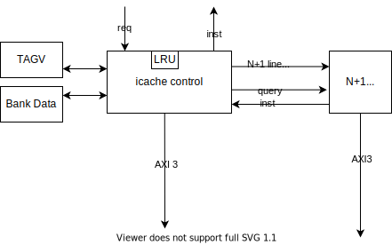
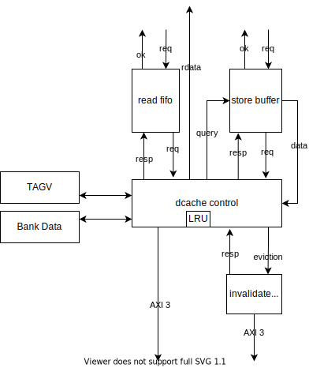

# HectorMIPS

“龙芯杯”北京邮电大学2021年参赛作品，一个高性能的双发射静态调度MIPS处理器。

## 概述

本项目是在“龙芯杯”大赛方提供的 FPGA 实验平台（FPGA 为 Artix-7 XC7A200T）上实现一个片上系统（SOC）。其中，CPU基于MIPS 32 Rev 1指令集架构，包含指令缓存和数据缓存；功能方面能够通过大赛方提供的功能测试、性能测试、系统测试；性能方面频率达 #TODO MHz，每时钟周期指令数为龙芯 GS132 的 #TODO 倍。

### 设计语言

HectorMIPS完全使用Chisel3编写，再通过Chisel3编译到Verilog导入到vivado中。得益于使用高级语言开发，我们可以有更高的开发速度和更低的bug率

### 设计框架

HectorMIPS中的CPU采用顺序双发射伪六级流水线架构，实现了包括除4条非对齐指令外的所有MIPS I指令、MIPS32中的ERET指令以及MUL指令，共58条指令，6个CP0 寄存器，3个中断，7种例外。CPU对外的访存通信通过四个接口，分别是Uncached属性指令接口、Cached属性指令接口、Uncached属性数据接口、Cached属性数据接口。四个接口通过AXI3协议，经过AXI Crossbar整合成为一个接口与外设交互。

HectorMIPS实现了指令缓存(I-Cache)与数据缓存(D-Cache)，响应CPU的取指与访存请求。I-Cache与D-Cache大小均为16K（#TODO确认大小），在连续命中时，能够实现不间断地流水返回数据。I-Cache与D-Cache分别引出一个AXI接口。D-Cache能够缓冲 CPU的写请求，并且实现了一个写回缓存 (Victim Cache)，兼具了缓存与写回队列的功能。

## CPU

### 流水线结构

CPU采用伪六级流水线结构：取指、指令队列、译码/发射、执行、访存、写回，在大部分情况下可以同时发射两条指令，

### 指令集

CPU 完成了大赛要求的57条指令以及系统测试需要用到的MUL指令：

* **算术运算指令** ADD, ADDU, SUB, SUBU, ADDI, ADDIU, SLT, SLTU, SLTI, SLTIU, MUL, MULT, MULTU, DIV, DIVU
* **逻辑运算指令** AND, OR, XOR, ANDI, ORI, XORI, NOR, LUI
* **移位指令** SLL, SRL, SRA, SLLV, SRLV, SRAV
* **访存指令** SB, SH, SW, LB, LBU, LH, LHU, LW
* **分支跳转指令** BEQ, BNE, BGEZ, BGTZ, BLEZ, BLTZ, BGEZAL, BLTZAL, J, JAL, JR, JALR
* **数据移动指令** MFHI, MFLO, MTHI, MTLO
* **特权指令** SYSCALL, BREAK, ERET, MTC0, MFC0

### 协处理器 0

CPU实现了大赛规定的协处理器0中的6个寄存器，所有寄存器如下：

* BadVAddr Register (CP0 Register 8, Select 0)
* Count Register (CP0 Register 9, Select 0)
* Compare Register (CP0 Register 11, Select 0)
* Status Register (CP Register 12, Select 0)
* Cause Register (CP0 Register 13, Select 0)
* Exception Program Counter (CP0 Register 14, Select 0)

### Cache
#### overview

* MemAccessLogic 负责判断地址是否是cache的数据；  
  同时，将虚拟地址转换为物理地址
* icache 和 dcache 分别缓存指令和数据；  
  对于uncache的数据和指令，不进行其他处理，直接访问AXI总线
#### icache

* 2路组相连
* 每路256行，每行64Byte，共32KB
* LRU 替换
* 每次返回2条指令，即8字节
* N+1 预取
* 关键字优先
#### dcache

* 2路组相连
* 每路256行，每行32Byte，共16KB
* LRU替换
* store buffer 非阻塞写
* 读口与写口分离
* 写回、写分配
* 关键字优先
* 支持同时驱逐和写入新行
### 中断和异常

＃TODO

### 分支预测

CPU实现了两级自适应分支预测，分支指令缓存使用64块（＃TODO确认数量）全相连映射，每一块使用4个（＃TODO确认数量）分支历史寄存器，用于记录同一条pc在不同情况下的跳转历史并作出预测，可以预测在2周期（＃TODO确认数量，为log2(bht_size)）以内出现的所有重复序列的模式。

每一次成功/失败的分支预测都会更新其对应pc的Branch history，再更新当前Branch history对应的2位饱和计数器。在预测分支时，即可通过branch history找到对应的饱和计数器，从而得到分支预测的结果

### 缓存设计

＃TODO

### CPU 外部接口

＃TODO

## 思考与展望

