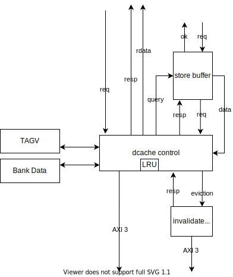

# HectorMIPS

“龙芯杯”北京邮电大学2021年参赛作品，一个高性能的双发射静态调度MIPS处理器。

## 概述

本项目是在“龙芯杯”大赛方提供的 FPGA 实验平台（FPGA 为 Artix-7 XC7A200T）上实现一个片上系统（SOC）。其中，CPU基于MIPS 32 Rev 1指令集架构，包含指令缓存和数据缓存；功能方面能够通过大赛方提供的功能测试、性能测试、系统测试；性能方面频率达 #TODO MHz，每时钟周期指令数为龙芯 GS132 的 #TODO 倍。

### 设计语言

HectorMIPS完全使用Chisel3编写，再通过Chisel3编译到Verilog导入到vivado中。得益于使用高级语言开发，我们可以有更高的开发速度和更低的bug率

### 设计框架

HectorMIPS中的CPU采用顺序双发射伪六级流水线架构，实现了包括除4条非对齐指令外的所有MIPS I指令、MIPS32中的ERET指令以及MUL指令，共58条指令，6个CP0 寄存器，3个中断，7种例外。CPU对外的访存通信通过指令sram接口和数据sram接口连接到地址转换逻辑，地址转换逻辑连接到icache,dcache,uncache data,uncache inst，最后四个接口通过AXI3协议，经过AXI Crossbar整合成为一个接口与外设交互。

HectorMIPS实现了指令缓存(I-Cache)与数据缓存(D-Cache)，响应CPU的取指与访存请求。I-Cache与D-Cache大小均为16K（#TODO确认大小），在连续命中时，能够实现不间断地流水返回数据。I-Cache与D-Cache分别引出一个AXI接口。D-Cache能够缓冲 CPU的写请求，并且实现了一个写回缓存 (Victim Cache)，兼具了缓存与写回队列的功能。

## CPU

### 流水线结构

CPU采用伪六级流水线结构：取指、指令队列、译码/发射、执行、访存、写回，在大部分情况下可以同时发射两条指令。

#### 取指级

根据当前已取出的指令的地址（pc）送至分支预测器，通过预测结果来得到新的取指地址发送给icache，icache得到请求之后返回结果由fetch组合逻辑处理后将结果送至指令队列中。

#### 指令队列

因为在调优过程中发现瓶颈在于前端的获取指令速度远小于后端消耗速度，我们在使用分支预测增加取指正确率的同时，使用一个指令队列来保存取到的指令数据，在大部分情况下保持指令队列非空，为解码阶段提供了足够的。

#### 译码级

由两个译码器、发射器和一个保留缓存得到，当取得两条指令，但是只有一条被发射的时候，选择将不发射的指令存入remain buffer中。与此同时，为了减轻执行级的负担，选择将溢出例外的判断挪到decoder中。

发射器主要负责判断译码器中的两条指令能否被同时发射，或者是能发射几条，一般来说，以下情况会选择只发射一条指令：

- 一条指令是访存指令
- 两条指令有部件冲突（同时使用乘/除法器）
- 两条指令有写后读冲突
- 两条指令有cp0冲突
- 一条指令需要写cp0的IP域
- 两条指令有hilo冲突
- 第二条指令无效

在第一条指令为分支指令时，会强制将其与延迟槽指令一同发射。

#### 执行级

将执行部件划分为AluEx和Alu，两者都能完成基本算术运算，AluEx可以额外完成乘除法运算，使用乘除法IP核进行实现，同时，由于至此所有的例外情况都已经出现，因此在执行级进行例外和中断的判断，如果第一条指令出现了例外（中断会强制打在第一条指令上），则将两条指令都无效化，如果第二条指令例外，则只无效化其自身，将第一条指令正常发射。

同时，执行级会向dcache发送访存请求，由于dcache接收新请求的充要条件是上一次访存结束，因此只需要等待dcache的有效信号即可继续前进。

#### 访存级

访存级主要负责接收访存请求的结果和控制信号，同时还负责处理来自dcache的结果（如lb、lh等指令）。为了优化时序，由于有一条从dcache到访存级的超长路径，我们选择在这一级放弃来自dcache的前递结果。

#### 写回级

在写回级，我们一方面需要对寄存器堆进行写回，另一方面我们也是在写回级对于cp0寄存器进行读入，这样可以有效的减少关于cp0的前递逻辑，优化时序。

#### 优化

为了优化时序，提升ipc，我们对于cpu做出了优化包括但不限于：

- 由于ex级本身逻辑就已经较为复杂，如果在这个阶段使用加法器进行溢出判断会极大的延长关键路径，于是我们选择将溢出的标志在译码级打上，直接送递至ex级。
- 前端指令供给速度跟不上后端消耗速度，通过增加读指令流水、分支预测和指令队列来满足后端的请求。
- 同频ipc过低、硬件利用率较低，通过将单发射流水线改造为双发射流水线。

#### 流水线控制

在HectorMIPS中，我们并没有采用一个统一控制器进行控制，而是使用流水线互锁的方式将多级流水线串联起来，一级流水能允许进入的必要条件是下一级流水线允许进入，当一级流水线允许进入后，如果没有来自上一级流水线的有效数据，则选择将当前的流水线寄存器中的valid信号置为0。这样即可保证每一级流水在自己的工作完成之后不会继续对流水线造成影响。

### 指令集

CPU 完成了大赛要求的57条指令以及系统测试需要用到的MUL指令：

* **算术运算指令** ADD, ADDU, SUB, SUBU, ADDI, ADDIU, SLT, SLTU, SLTI, SLTIU, MUL, MULT, MULTU, DIV, DIVU
* **逻辑运算指令** AND, OR, XOR, ANDI, ORI, XORI, NOR, LUI
* **移位指令** SLL, SRL, SRA, SLLV, SRLV, SRAV
* **访存指令** SB, SH, SW, LB, LBU, LH, LHU, LW
* **分支跳转指令** BEQ, BNE, BGEZ, BGTZ, BLEZ, BLTZ, BGEZAL, BLTZAL, J, JAL, JR, JALR
* **数据移动指令** MFHI, MFLO, MTHI, MTLO
* **特权指令** SYSCALL, BREAK, ERET, MTC0, MFC0

### 协处理器 0

CPU实现了大赛规定的协处理器0中的6个寄存器，所有寄存器如下：

* BadVAddr Register (CP0 Register 8, Select 0)
* Count Register (CP0 Register 9, Select 0)
* Compare Register (CP0 Register 11, Select 0)
* Status Register (CP Register 12, Select 0)
* Cause Register (CP0 Register 13, Select 0)
* Exception Program Counter (CP0 Register 14, Select 0)

## Cache设计

### overview

CPU 首先通过两个类sram接口访问`MemAccessLogic `。`MemAccessLogic ` 判断地址是否是cache的数据；  同时，将虚拟地址转换为物理地址。对于指令请求，`MemAccessLogic`会将其放入队列；对于数据请求，`MemAccessLogic`则直接转发请求。

`icache` 和 `dcache` 分别缓存指令和数据；对于uncache的数据和指令，不进行其他处理，直接访问AXI总线。

`crossbar`是一个IP核。它将4条AXI3的总线合并成一条转发出去。

### icache

#### 参数

* 2路组相连
* 每路256行，每行64Byte，共32KB
* LRU 替换
* 每次返回2条指令，即8字节
* N+1 预取
* 关键字优先

为了能够响应双发射CPU的取指请求，`icache`返回的是请求地址后两条指令（但对于cache行最后一个字的地址，返回的第二条指令是无效的）。

`icache`工作时，在请求的第一拍，向bram发起请求；第二拍取得`tag`、`valid`、`data`的数据。如果命中的话，返回指令；否则，向AXI总线发起请求。发起的读请求使用突发模式WRAP，以实现关键字优先的效果。

`tag`和`valid`的bram是双端口ram，第一个端口用于处理正常请求，另一个端口传入的地址是当前指令字地址下一行的地址（比如，1fc12300对应的下一行地址就是1fc2320），用于检测下一行是否已经存入cache。如果没有存入cache，那么由预取器去取出下一行数据，并暂存在预取器中。当访问下一行指令并发生miss的时候，就能直接从预取器中取出数据。

### dcache

#### 参数
* 2路组相连
* 每路256行，每行32Byte，共16KB
* LRU替换
* store buffer
* 读口与写口分离
* 写回、写分配
* 关键字优先
* 支持同时驱逐和写入新行

dcache内部将读和写分离。对于一个发来的请求，若是读请求，则会进入读队列；否则，进入写队列。

对于读队列，如果命中，则第二拍就能返回数据；除了查询`tag` bram，dcache还会查询store buffer。并且以store buffer的数据优先。如果出现同时在store buffer中取到，并且也在`tag` bram中取到，那么会以store buffer的数据优先。如果没有命中，则会向AXI总线发起请求。如果要填充的位置已经有数据，那么会同时向写回器发起请求，因为写回握完手后就能直接传输数据，因此可以在等待新数据的同时，向总线写入被驱逐行的数据。

对于写队列，若队列未满的情况下，每次写请求都能在两拍内返回data_ok。其中第一拍是将数据放入缓冲寄存器，以优化时序。当dcache写端口空闲并且写队列有数据时，写端口就会逐一把写数据写入到cache中。对于同一个字的多次写入，写队列会将其合并到同一项上，并用掩码标记写入的是哪个Byte。

如果读端口和写端口同时操作同一个地址，那么空闲状态的会被阻塞，直到它们不再操作同一地址。如果两者都在空闲状态，那么读端口优先。因为读数据需要阻塞流水线，因此优先给读数据。
### 中断和异常

＃TODO

### 分支预测

CPU实现了两级自适应分支预测，分支指令缓存使用64块（＃TODO确认数量）全相连映射，每一块使用4个（＃TODO确认数量）分支历史寄存器，用于记录同一条pc在不同情况下的跳转历史并作出预测，可以预测在2周期（＃TODO确认数量，为log2(bht_size)）以内出现的所有重复序列的模式。

每一次成功/失败的分支预测都会更新其对应pc的Branch history，再更新当前Branch history对应的2位饱和计数器。在预测分支时，即可通过branch history找到对应的饱和计数器，从而得到分支预测的结果

### CPU 外部接口

＃TODO

## 思考与展望

由于开始制作CPU是从7月初开始，并且一开始团队中的分工并不是很合理，同时大部分成员并没有接触过chisel编程，于是导致起始的进度较慢，同时因为过程中对于硬件调试较为不熟悉，很多时间浪费在了无意义的试错上，这也说明测试用例的不完善。
